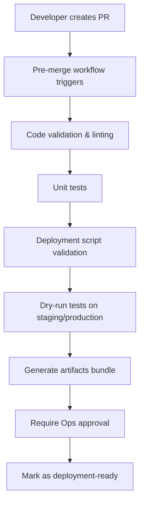
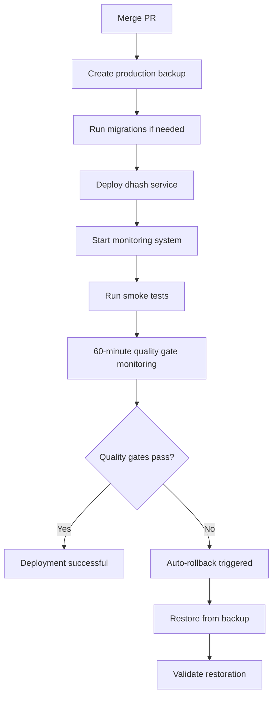

# dhash Guarded Rollout System

## Overview

This document describes the complete guarded production rollout system for dhash, including automation, monitoring, rollback capabilities, and notifications. The system provides enterprise-grade deployment safety through comprehensive pre-merge validation, automated backups, quality gates, and zero-dependency notifications.

## System Architecture

### Core Components

1. **Deployment Scripts** (`scripts/`)
   - `backup_dhash.sh` - Automated backups with SHA256 verification
   - `deploy_dhash.sh` - Deployment with dry-run support
   - `migrate_dhash.sh` - Database migrations with rollback capability
   - `rollback_dhash.sh` - Automated rollback with validation

2. **Monitoring & Quality Gates**
   - `monitor_dhash.js` - 60-minute post-deploy monitoring
   - `quality-gates-config.json` - Configurable thresholds
   - Automatic rollback on quality gate failures

3. **Notification System**
   - `notify.js` - Multi-channel notifications (Slack/Teams/Discord/Email)
   - `deploy-notify.js` - Deployment-specific notifications
   - Retry/backoff mechanism with file-based fallback

4. **Testing & Validation**
   - `smoke_tests.sh` - Post-deployment validation
   - `validate_logging.js` - Logging system verification
   - Integration with existing golden test infrastructure

5. **CI/CD Integration**
   - `.github/workflows/premerge.yml` - Pre-merge validation
   - Artifact collection and validation
   - Multi-platform testing (Ubuntu/macOS/Windows)

## Deployment Flow

### 1. Pre-merge Phase



**Validation includes:**
- Code linting and unit tests
- Deployment script functionality checks
- Dry-run deployment tests for multiple environments
- Quality gates configuration validation
- Notification system testing
- Artifact bundle generation

**Required approvals:**
- At least 2 code reviewers
- At least 1 Ops/SRE team member (@ops)

### 2. Deployment Phase



**Deployment steps:**
1. **Backup Creation**: Automated backup with SHA256 checksums
2. **Migration Execution**: Database/config migrations with dry-run validation
3. **Service Deployment**: Code deployment with health checks
4. **Monitoring Activation**: 60-minute quality gate monitoring
5. **Smoke Testing**: Immediate post-deployment validation

### 3. Monitoring & Auto-rollback

The monitoring system continuously evaluates quality gates for 60 minutes post-deployment:

**Quality Gates (Production defaults):**
- Health failures: >2 consecutive non-OK checks → Auto-rollback
- Extraction failure rate: >5% over 10 minutes → Auto-rollback  
- P95 hash time: >2000ms over 15 minutes → Auto-rollback
- Low-confidence queue length: >1000 items → Auto-rollback
- Memory usage: >85% → Alert only
- Error rate: >3% over 5 minutes → Alert only

**Monitoring intervals:**
- First 5 minutes: 30-second polling
- Remaining 55 minutes: 2-minute polling

**Auto-rollback process:**
1. Quality gate failure detected
2. Critical notification sent immediately
3. Latest backup located and verified
4. Rollback script executed with force flag
5. Post-rollback validation performed
6. Success/failure notification sent

## Configuration

### Quality Gates Configuration

The `quality-gates-config.json` file contains environment-specific thresholds:

```json
{
  "environments": {
    "production": {
      "monitoring": {
        "window_minutes": 60,
        "poll_intervals": {
          "initial_minutes": 5,
          "initial_interval_seconds": 30,
          "normal_interval_seconds": 120
        }
      },
      "quality_gates": {
        "health": {
          "enabled": true,
          "threshold": {
            "consecutive_failures": 2
          },
          "actions": ["alert", "auto_rollback"]
        }
      }
    }
  }
}
```

### Notification Configuration

Environment variables or `.env.notifications` file:

```bash
SLACK_WEBHOOK_URL=https://hooks.slack.com/...
SLACK_CHANNEL=#alerts
TEAMS_WEBHOOK_URL=https://outlook.office.com/...
DISCORD_WEBHOOK_URL=https://discord.com/api/webhooks/...
EMAIL_FROM=dhash-monitor@company.com
EMAIL_TO=ops@company.com,oncall@company.com
```

## Key Features

### 1. Zero-dependency Notifications
- No external service dependencies beyond webhook endpoints
- File-based fallback when webhooks are unreachable
- Retry mechanism with exponential backoff
- Support for Slack, Teams, Discord, and Email

### 2. Comprehensive Backup System
- Automated pre-deployment backups
- SHA256 integrity verification
- Backup retention management
- Cross-platform compatible (Linux/macOS/Windows)

### 3. Configurable Quality Gates
- Environment-specific thresholds
- Per-environment enable/disable controls
- Configurable actions (alert-only vs auto-rollback)
- Real-time monitoring with adaptive polling

### 4. Robust Rollback Mechanism
- Automated backup discovery
- Pre-rollback current state backup
- Multi-step validation process
- Emergency rollback options

### 5. Multi-platform CI Integration
- Cross-platform testing (Ubuntu/macOS/Windows)
- Parallel dry-run validation
- Comprehensive artifact collection
- Integration with existing golden tests

## Usage Examples

### Standard Production Deployment

```bash
# 1. Create backup
./scripts/backup_dhash.sh --env production

# 2. Deploy with backup
./scripts/deploy_dhash.sh --env production --backup-first

# 3. Start monitoring (runs for 60 minutes)
node scripts/monitor_dhash.js --env production
```

### Emergency Rollback

```bash
# Find latest backup
LATEST_BACKUP=$(ls -1 backups/dhash_*.zip | sort -r | head -n1)

# Verify backup integrity
sha256sum -c "${LATEST_BACKUP}.sha256"

# Execute rollback
./scripts/rollback_dhash.sh --backup "$LATEST_BACKUP" --env production
```

### Dry-run Testing

```bash
# Test full deployment flow without execution
./scripts/backup_dhash.sh --dry-run --env production
./scripts/migrate_dhash.sh --dry-run --env production  
./scripts/deploy_dhash.sh --dry-run --env production
node scripts/monitor_dhash.js --env production --dry-run
```

## Monitoring and Observability

### Log Files
- **Deployment logs**: `monitor_logs/deploy_*.log`
- **Monitoring logs**: `monitor_logs/dhash_*.log` 
- **Smoke test logs**: `monitor_logs/smoke_tests_*.log`
- **Notification fallback**: `monitor_logs/notification_fallback.jsonl`

### Metrics and Health Checks
- Health endpoint: `GET /health`
- Metrics endpoint: `GET /metrics`
- Queue status: `GET /api/dhash/queue/status`

### Real-time Monitoring
```bash
# Follow monitoring logs
tail -f monitor_logs/dhash_production_*.log

# Check quality gate status
grep "Quality gate" monitor_logs/dhash_production_*.log | tail -10

# View notification history
cat monitor_logs/notification_fallback.jsonl | tail -5 | jq .
```

## Best Practices

### 1. Pre-deployment
- Always run dry-run tests in staging first
- Verify backup integrity before deployment
- Ensure notification channels are working
- Obtain required approvals before merging

### 2. During Deployment
- Monitor deployment logs in real-time
- Keep rollback command ready
- Don't interrupt monitoring window unless emergency
- Validate smoke tests pass before considering deployment complete

### 3. Post-deployment
- Review monitoring logs for any warnings
- Archive deployment artifacts
- Update documentation if configuration changed
- Conduct post-deployment retrospective if issues occurred

### 4. Incident Response
- Use emergency rollback procedures for critical issues
- Document all manual interventions
- Update quality gate thresholds if frequent false positives
- Review notification effectiveness

## Security Considerations

### 1. Backup Security
- Backups contain sensitive configuration and data
- SHA256 checksums prevent tampering
- Secure backup storage location
- Regular backup cleanup

### 2. Webhook Security
- Use HTTPS webhooks only
- Consider webhook URL rotation
- Monitor for webhook failures
- Implement rate limiting if needed

### 3. Access Control
- Limit deployment script execution permissions
- Require multiple approvals for production changes
- Audit deployment activities
- Secure notification channel access

## Troubleshooting

### Common Issues

1. **Quality Gate False Positives**
   - Review threshold configuration
   - Check for external dependencies
   - Validate metrics collection
   - Adjust polling intervals

2. **Notification Failures**
   - Verify webhook URLs
   - Check network connectivity
   - Review fallback file
   - Test notification channels

3. **Rollback Issues**
   - Verify backup integrity
   - Check disk space
   - Validate file permissions
   - Review service dependencies

See [DEPLOYMENT_OPERATIONS_GUIDE.md](./DEPLOYMENT_OPERATIONS_GUIDE.md) for detailed troubleshooting procedures.

## Migration from Existing Systems

If migrating from an existing deployment system:

1. **Phase 1**: Deploy guarded rollout scripts alongside existing system
2. **Phase 2**: Run parallel deployments for validation
3. **Phase 3**: Gradually increase quality gate sensitivity
4. **Phase 4**: Full cutover to guarded rollout system
5. **Phase 5**: Remove legacy deployment infrastructure

## Contributing

### Adding New Quality Gates
1. Update `quality-gates-config.json` schema
2. Implement gate evaluation logic in `monitor_dhash.js`
3. Add tests to pre-merge validation
4. Update documentation
5. Test in staging environment first

### Extending Notification Channels
1. Add channel configuration to `notify.js`
2. Implement message formatting for new channel
3. Add retry logic and error handling
4. Update documentation and examples
5. Test with dry-run mode

## Version History

- **v1.0.0**: Initial implementation with basic quality gates
- **v1.1.0**: Added multi-channel notifications and improved monitoring
- **v1.2.0**: Enhanced CI/CD integration and artifact generation
- **v1.3.0**: Added logging validation and improved error handling

## License

This guarded rollout system is part of the MOBIUS project and follows the same license terms.