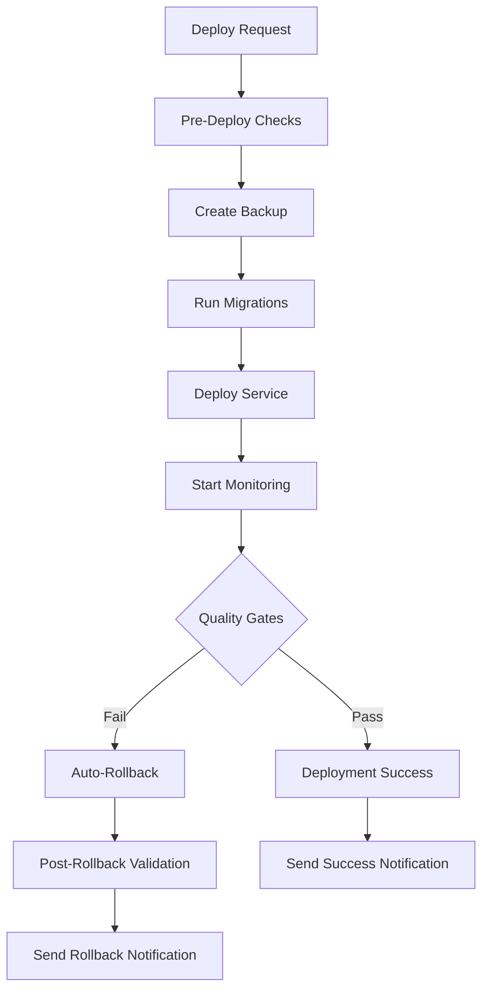

# dhash Guarded Production Rollout System

🚀 **Enterprise-grade deployment automation with monitoring, quality gates, and auto-rollback capabilities**

## Quick Start

```bash
# 1. Create backup
./scripts/backup_dhash.sh --env production

# 2. Deploy with monitoring
./scripts/deploy_dhash.sh --env production

# 3. Monitor automatically starts (60-minute window)
# Quality gates will trigger auto-rollback if thresholds are violated
```

## Overview

The dhash guarded rollout system provides enterprise-grade deployment capabilities that reduce risk while improving visibility and recovery time. The system includes:

- ✅ **Automated pre-merge validation** across multiple platforms
- 🔒 **Durable backups** with SHA256 verification
- 📊 **Configurable monitoring** with quality gates
- 🔄 **Automatic rollback** on quality gate violations
- 📱 **Multi-channel notifications** (Slack, Teams, Discord, Email)
- 🧪 **Comprehensive testing** (smoke tests, logging validation)
- 📚 **Complete documentation** and operational runbooks

## System Components

### Deployment Automation

| Script | Purpose | Key Features |
|--------|---------|-------------|
| [`deploy_dhash.sh`](scripts/deploy_dhash.sh) | Main deployment script | Dry-run support, pre-checks, monitoring hooks |
| [`migrate_dhash.sh`](scripts/migrate_dhash.sh) | Database migrations | Dry-run, rollback support, transaction safety |
| [`backup_dhash.sh`](scripts/backup_dhash.sh) | Backup creation | SHA256 verification, retention policies |

### Monitoring & Quality Gates

| Component | Purpose | Configuration |
|-----------|---------|--------------|
| [`monitor_dhash.js`](scripts/monitor_dhash.js) | Real-time monitoring | 60-minute window, configurable thresholds |
| [`quality-gates-config.json`](quality-gates-config.json) | Quality gate thresholds | Environment-specific settings |

### Rollback & Recovery

| Script | Purpose | Capabilities |
|--------|---------|-------------|
| [`rollback_dhash.sh`](scripts/rollback_dhash.sh) | Service rollback | Verified restore, post-restore checks |

### Notifications

| Script | Purpose | Channels |
|--------|---------|----------|
| [`notify.js`](scripts/notify.js) | General notifications | Slack, Teams, Discord, Email, Console, File |
| [`deploy-notify.js`](scripts/deploy/deploy-notify.js) | Deployment-specific | Integration with CI/CD pipelines |

### Testing & Validation

| Script | Purpose | Features |
|--------|---------|----------|
| [`smoke_tests.sh`](scripts/smoke_tests.sh) | Post-deployment validation | API tests, performance checks, security validation |
| [`validate_logging.js`](scripts/validate_logging.js) | Logging system validation | Concurrency testing, redaction verification |

## Architecture



## Quality Gates

### Default Thresholds (Production)

| Metric | Threshold | Time Window | Action |
|--------|-----------|-------------|--------|
| Health Failures | > 2 consecutive | N/A | Auto-rollback |
| Extraction Failure Rate | > 5% | 10 minutes | Auto-rollback |
| P95 Hash Time | > 2000ms | 15 minutes | Auto-rollback |
| Queue Length | > 1000 items | N/A | Auto-rollback |

### Configurable Per Environment

```json
{
  "environments": {
    "staging": { "healthFailures": { "threshold": 3 } },
    "production": { "healthFailures": { "threshold": 2 } },
    "canary": { "healthFailures": { "threshold": 1 } }
  }
}
```

## Usage Examples

### Development Workflow

```bash
# 1. Create feature branch
git checkout -b feature/my-feature

# 2. Make changes and test locally
./scripts/deploy_dhash.sh --dry-run --env staging

# 3. Create PR - premerge validation runs automatically
# 4. After approval, merge using rebase-and-merge
```

### Production Deployment

```bash
# 1. Create production backup
./scripts/backup_dhash.sh --env production --retention-days 14

# 2. Verify backup integrity
LATEST_BACKUP=$(ls -1 backups/dhash_*.zip | sort -r | head -n1)
sha256sum -c "${LATEST_BACKUP}.sha256"

# 3. Test deployment in dry-run mode
./scripts/deploy_dhash.sh --dry-run --env production

# 4. Execute production deployment
./scripts/deploy_dhash.sh --env production

# 5. Monitoring starts automatically (60 minutes)
# Watch for notifications or check logs:
tail -f logs/monitor_production_*.log
```

### Emergency Rollback

```bash
# Quick rollback using latest backup
./scripts/rollback_dhash.sh --env production --reason "emergency-rollback"

# Rollback to specific backup
./scripts/rollback_dhash.sh \
  --env production \
  --backup "backups/dhash_production_20240101_120000.zip" \
  --reason "specific-version-rollback"
```

### Custom Notifications

```bash
# Send deployment start notification
node scripts/deploy/deploy-notify.js \
  --phase start \
  --env production \
  --version v1.2.3 \
  --initiator alice

# Send custom notification to multiple channels
node scripts/notify.js \
  --type warning \
  --env production \
  --message "Scheduled maintenance in 1 hour" \
  --channels "slack,teams,email"
```

## Installation & Setup

### Prerequisites

- **Node.js** 18+ (for monitoring and notifications)
- **Bash** 4+ (for deployment scripts)
- **curl** (for API calls and health checks)
- **zip/unzip** (for backup creation/restoration)
- **sha256sum** (for backup verification)

### Initial Setup

```bash
# 1. Clone repository
git clone <repository-url>
cd MOBIUS

# 2. Install dependencies
npm install

# 3. Create required directories
mkdir -p logs backups config migrations

# 4. Set up configuration files
cp config/dhash_staging.conf.example config/dhash_staging.conf
cp config/dhash_production.conf.example config/dhash_production.conf

# 5. Configure webhook URLs (optional)
export SLACK_WEBHOOK_URL="https://hooks.slack.com/..."
export TEAMS_WEBHOOK_URL="https://outlook.office.com/..."

# 6. Make scripts executable
chmod +x scripts/*.sh

# 7. Validate setup
./scripts/deploy_dhash.sh --help
node scripts/monitor_dhash.js --help
```

## Configuration

### Environment Configuration

Create configuration files for each environment:

**`config/dhash_production.conf`:**
```bash
DHASH_SERVICE_NAME=dhash-production
DHASH_IMAGE_TAG=v1.2.3
DHASH_REPLICAS=3
DHASH_MEMORY_LIMIT=2Gi
DHASH_CPU_LIMIT=1000m
```

**`config/db_production.conf`:**
```bash
DB_HOST=prod-db.company.com
DB_PORT=5432
DB_NAME=dhash_prod
DB_USER=dhash_prod_user
```

### Quality Gates Tuning

Edit [`quality-gates-config.json`](quality-gates-config.json) to customize thresholds:

```json
{
  "environments": {
    "production": {
      "qualityGates": {
        "healthFailures": { "threshold": 2 },
        "extractionFailureRate": { "threshold": 5.0, "timeWindow": 10 },
        "p95HashTime": { "threshold": 2000, "timeWindow": 15 },
        "lowConfidenceQueue": { "threshold": 1000 }
      },
      "autoRollback": true
    }
  }
}
```

## CI/CD Integration

### GitHub Actions

The system includes a comprehensive premerge validation workflow:

- **Multi-platform testing** (Ubuntu, macOS, Windows)
- **Script validation** and dry-run testing
- **Cross-platform compatibility** checks
- **Artifact generation** and validation

**Workflow:** [`.github/workflows/premerge.yml`](.github/workflows/premerge.yml)

### Other CI Systems

The scripts are designed to work with any CI/CD system:

```yaml
# GitLab CI example
deploy-production:
  script:
    - ./scripts/backup_dhash.sh --env production
    - ./scripts/deploy_dhash.sh --env production
  only:
    - main
```

## Monitoring Dashboard

### Real-time Monitoring

```bash
# Start monitoring for 60 minutes
node scripts/monitor_dhash.js --env production --duration 60

# Custom monitoring with different settings
node scripts/monitor_dhash.js \
  --env production \
  --config quality-gates-config.json \
  --duration 30
```

### Monitoring Output

```
[2024-01-01 12:00:00] [INFO] Starting 60-minute monitoring window
[2024-01-01 12:00:00] [INFO] --- Monitoring cycle (0/60 minutes, 60 remaining) ---
[2024-01-01 12:00:01] [INFO] Health check: OK (150ms)
[2024-01-01 12:00:02] [INFO] Extraction failure rate: 2.1% (avg: 2.1%)
[2024-01-01 12:00:03] [INFO] Hash time: 850ms (P95: 950ms over 10 samples)
[2024-01-01 12:00:04] [INFO] Queue length: 234 items (confidence: 87.3%)
[2024-01-01 12:00:05] [SUCCESS] All quality gates: PASS
```

## Testing

### Smoke Tests

```bash
# Run post-deployment smoke tests
./scripts/smoke_tests.sh --env production --timeout 600

# Run post-rollback validation
./scripts/smoke_tests.sh --env production --post-rollback
```

### Logging Validation

```bash
# Test logging system
node scripts/validate_logging.js --env production --concurrency 10
```

### Manual Testing

```bash
# Test all scripts in dry-run mode
./scripts/backup_dhash.sh --env staging
./scripts/deploy_dhash.sh --dry-run --env staging
./scripts/migrate_dhash.sh --dry-run --env staging
```

## Backup Management

### Automatic Backups

Backups are created automatically before each deployment with:
- **Timestamped naming** (e.g., `dhash_production_20240101_120000.zip`)
- **SHA256 checksums** for integrity verification
- **Automatic retention** (configurable, default 7 days)

### Manual Backup Operations

```bash
# Create backup with custom retention
./scripts/backup_dhash.sh --env production --retention-days 30

# Verify backup integrity
LATEST_BACKUP=$(ls -1 backups/dhash_*.zip | sort -r | head -n1)
sha256sum -c "${LATEST_BACKUP}.sha256"

# List all backups
ls -la backups/dhash_*.zip
```

## Security Considerations

### Sensitive Data Redaction

The logging validation script tests for:
- Passwords and tokens
- API keys and secrets  
- Credit card numbers
- Email addresses
- SSN formats

### Webhook Security

- Use HTTPS webhooks only
- Store webhook URLs in CI/CD secrets
- Test webhook connectivity before deployment
- Implement fallback notification methods

### Access Control

- Limit production deployment access
- Require 2+ approvers for production PRs
- Use branch protection rules
- Log all deployment activities

## Troubleshooting

### Common Issues

#### Backup Integrity Failure
```bash
# Problem: SHA256 checksum mismatch
# Solution: Create new backup
./scripts/backup_dhash.sh --env production
```

#### Network Connectivity Issues
```bash
# Test webhook connectivity
curl -f "$SLACK_WEBHOOK_URL"

# Use dry-run mode
node scripts/notify.js --type deploy --message "test" --dry-run
```

#### Quality Gate False Positives
```bash
# Adjust thresholds temporarily
# Edit quality-gates-config.json
# Restart monitoring with updated config
```

### Debug Mode

Enable verbose logging:
```bash
# Set debug mode
export DEBUG=1

# Run with verbose output
./scripts/deploy_dhash.sh --env staging --verbose
```

### Log Analysis

```bash
# View deployment logs
tail -f logs/deploy_production_*.log

# Check monitoring reports
cat logs/monitor_report_production_*.json | jq .

# Review notification history
cat logs/notifications.json | jq '.[] | select(.type == "error")'
```

## Best Practices

### Deployment

1. **Always test in staging first**
2. **Create backups before every deployment**
3. **Use dry-run mode to validate scripts**
4. **Monitor the full 60-minute window**
5. **Keep deployment windows small and focused**

### Monitoring

1. **Tune quality gates based on production telemetry**
2. **Review false positive rates weekly**
3. **Adjust thresholds for business hours vs off-hours**
4. **Set up multiple notification channels**

### Backup Strategy

1. **Test backup restore procedures regularly**
2. **Verify backup integrity before deployments**
3. **Maintain appropriate retention policies**
4. **Store backups in multiple locations**

## Roadmap

### Planned Features

- [ ] **Blue/Green Deployments**: Zero-downtime deployment strategy
- [ ] **Canary Releases**: Gradual traffic shifting
- [ ] **Advanced Metrics**: Custom application metrics integration
- [ ] **Multi-Region Support**: Cross-region deployment coordination
- [ ] **GitOps Integration**: Kubernetes-native deployment workflows

### Continuous Improvement

- **Performance Optimization**: Based on production usage patterns
- **Enhanced Monitoring**: Additional quality gate metrics
- **Improved Documentation**: Based on user feedback
- **Extended Platform Support**: Additional CI/CD integrations

## Support

### Documentation

- **[Deployment Operations Guide](DEPLOYMENT_OPERATIONS_GUIDE.md)**: Detailed operational procedures
- **[PR Template](templates/PR_BODY.md)**: Standard PR description format
- **[Notification Templates](templates/notifications/)**: Customizable notification formats

### Getting Help

- **Issues**: Create GitHub issues for bugs/feature requests
- **Discussions**: Use GitHub discussions for questions
- **Emergency**: Contact on-call engineer via Slack @oncall-dhash

### Contributing

1. Fork the repository
2. Create feature branch
3. Add comprehensive tests
4. Update documentation
5. Submit PR with required artifacts

---

## License

MIT License - see [LICENSE](LICENSE) for details.

## Changelog

See [CHANGELOG.md](CHANGELOG.md) for version history and release notes.

---

*Built with ❤️ for reliable, automated deployments*