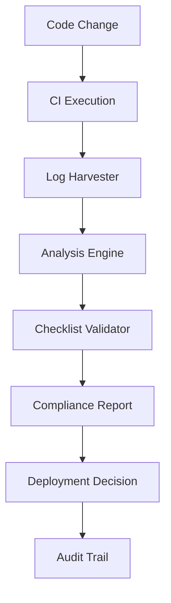

# Automation Backlog - CI Log-Harvest and Checklist Validator Integration

## Overview
This document outlines the planned automation enhancements to achieve full end-to-end traceability for the Mobius Games Tutorial Generator project. The automation will build upon the successful branch protection rollout and stabilization monitoring system.

## Current State Assessment

### ✅ Completed Components
- **Branch Protection Enforcement:** Six CI contexts required for main branch merges
- **Stabilization Monitoring:** Automated anomaly detection and issue creation
- **Manual Logging Tools:** PowerShell and Bash scripts for CI health tracking
- **Comprehensive Documentation:** Runbooks, checklists, and audit trails
- **Security Controls:** Token management and audit procedures

### 🔄 Active Components
- **72-Hour Stabilization Watch:** Monitoring CI health post-rollout
- **Daily Health Logging:** Evidence collection for protection effectiveness
- **Anomaly Response:** Automated issue creation for CI irregularities

## Automation Roadmap

### Phase 1: CI Log-Harvest Automation (Priority: High)
**Timeline:** Next Sprint (2 weeks)  
**Goal:** Automated collection, analysis, and reporting of CI logs

#### 1.1 Log Collection System
**Components:**
- **GitHub Actions Workflow:** `ci-log-harvester.yml`
- **Storage:** Structured log storage in repository
- **Retention:** Configurable retention policies
- **Format:** JSON-structured logs for analysis

**Implementation:**
```yaml
# .github/workflows/ci-log-harvester.yml
name: CI Log Harvester
on:
  workflow_run:
    workflows: ["CI"]
    types: [completed]
jobs:
  harvest-logs:
    runs-on: ubuntu-latest
    steps:
      - name: Collect CI Logs
        # Automated log collection logic
      - name: Analyze Performance
        # Performance metrics extraction
      - name: Store Artifacts
        # Structured storage of logs
```

**Features:**
- Automatic log collection on CI completion
- Performance metrics extraction (duration, success rate, resource usage)
- Failure pattern analysis and categorization
- Historical trend tracking and reporting

#### 1.2 Log Analysis Engine
**Components:**
- **Pattern Recognition:** Identify common failure patterns
- **Performance Analytics:** Track CI performance trends
- **Anomaly Detection:** Statistical analysis for unusual patterns
- **Reporting:** Automated reports and dashboards

**Metrics Tracked:**
- CI run duration by platform (macOS, Ubuntu, Windows)
- Success/failure rates over time
- Flaky test identification
- Resource utilization patterns
- Dependency installation times

#### 1.3 Integration Points
- **Stabilization Monitor:** Enhanced with log analysis data
- **Issue Creation:** Automatic issues for performance degradation
- **Dashboard:** Real-time CI health visualization
- **Alerts:** Proactive notifications for CI issues

### Phase 2: Checklist Validator Integration (Priority: Medium)
**Timeline:** Following Sprint (2 weeks after Phase 1)  
**Goal:** Automated validation of operational procedures and compliance

#### 2.1 Checklist Automation Framework
**Components:**
- **Validation Engine:** Automated checklist item verification
- **Integration Points:** CI pipeline, deployment processes
- **Reporting:** Compliance status and gap analysis
- **Enforcement:** Blocking mechanisms for incomplete checklists

**Implementation:**
```yaml
# .github/workflows/checklist-validator.yml
name: Checklist Validator
on:
  pull_request:
  push:
    branches: [main]
jobs:
  validate-checklist:
    runs-on: ubuntu-latest
    steps:
      - name: Validate Pre-deployment Checklist
        # Automated checklist validation
      - name: Check Compliance Requirements
        # Compliance verification
      - name: Generate Report
        # Validation report generation
```

#### 2.2 Automated Validation Rules
**Pre-deployment Checklist:**
- [ ] All tests passing (automated via CI status)
- [ ] Code review completed (GitHub API verification)
- [ ] No linting errors (automated via CI logs)
- [ ] Documentation updated (git diff analysis)
- [ ] Security scan completed (integration with security tools)

**CI/CD Pipeline Validation:**
- [ ] All six contexts passing (GitHub API check)
- [ ] Branch protection enforced (API verification)
- [ ] Working directory correctly set (workflow file analysis)
- [ ] Dependencies up-to-date (package-lock.json validation)

**Security Validation:**
- [ ] No hardcoded secrets (automated scanning)
- [ ] Token permissions appropriate (API verification)
- [ ] Audit trail complete (log verification)

#### 2.3 Compliance Reporting
**Features:**
- Real-time compliance dashboard
- Historical compliance trends
- Gap analysis and remediation suggestions
- Automated compliance reports for stakeholders

### Phase 3: End-to-End Traceability (Priority: Medium)
**Timeline:** Month 2 (4 weeks after Phase 2)  
**Goal:** Complete audit trail from code change to deployment

#### 3.1 Traceability Framework
**Components:**
- **Change Tracking:** Link code changes to CI runs to deployments
- **Artifact Lineage:** Track all artifacts through the pipeline
- **Decision Audit:** Record all automated and manual decisions
- **Compliance Trail:** Complete regulatory compliance documentation

#### 3.2 Integration Architecture


#### 3.3 Audit Trail Components
- **Code Provenance:** Git commit to deployment mapping
- **CI Execution:** Complete CI run documentation
- **Quality Gates:** All quality checks and results
- **Security Validation:** Security scan results and approvals
- **Deployment Record:** Deployment artifacts and verification
- **Monitoring Data:** Post-deployment health metrics

## Implementation Plan

### Sprint 1: CI Log-Harvest Foundation
**Week 1:**
- [ ] Design log collection workflow
- [ ] Implement basic log harvesting
- [ ] Create structured storage system
- [ ] Develop initial analysis capabilities

**Week 2:**
- [ ] Add performance metrics extraction
- [ ] Implement anomaly detection
- [ ] Create reporting dashboard
- [ ] Integration testing with existing monitoring

**Deliverables:**
- Automated CI log collection system
- Performance metrics dashboard
- Enhanced anomaly detection
- Integration with stabilization monitor

### Sprint 2: Checklist Validator Development
**Week 3:**
- [ ] Design validation framework
- [ ] Implement core validation engine
- [ ] Create validation rules for key checklist items
- [ ] Develop reporting capabilities

**Week 4:**
- [ ] Integration with CI pipeline
- [ ] Automated compliance checking
- [ ] Dashboard development
- [ ] Testing and refinement

**Deliverables:**
- Automated checklist validation system
- Compliance reporting dashboard
- CI pipeline integration
- Validation rule library

### Sprint 3: End-to-End Integration
**Week 5-6:**
- [ ] Design traceability architecture
- [ ] Implement artifact lineage tracking
- [ ] Create audit trail system
- [ ] Develop compliance reporting

**Week 7-8:**
- [ ] Integration testing
- [ ] Performance optimization
- [ ] Documentation and training
- [ ] Production deployment

**Deliverables:**
- Complete traceability system
- Audit trail automation
- Compliance reporting suite
- Team training materials

## Technical Architecture

### Data Flow
1. **Code Change** → Git webhook triggers CI
2. **CI Execution** → Log harvester collects data
3. **Log Analysis** → Performance and quality metrics extracted
4. **Checklist Validation** → Automated compliance checking
5. **Traceability** → Complete audit trail generation
6. **Reporting** → Dashboards and compliance reports

### Storage Strategy
- **Logs:** Time-series database for performance data
- **Artifacts:** Git-based storage for traceability
- **Metadata:** JSON documents for structured data
- **Reports:** Generated artifacts with retention policies

### Integration Points
- **GitHub API:** Repository and CI data
- **Workflow Integration:** Seamless CI/CD pipeline integration
- **Monitoring Systems:** Enhanced alerting and dashboards
- **Compliance Tools:** Automated regulatory reporting

## Success Metrics

### Phase 1 Success Criteria
- [ ] 100% CI run log collection
- [ ] <5 minute delay in log processing
- [ ] 95% accuracy in anomaly detection
- [ ] 50% reduction in manual log analysis time

### Phase 2 Success Criteria
- [ ] 90% checklist automation coverage
- [ ] <2 minute validation time
- [ ] 100% compliance tracking accuracy
- [ ] Zero compliance gaps in production deployments

### Phase 3 Success Criteria
- [ ] Complete end-to-end traceability
- [ ] <1 hour audit trail generation
- [ ] 100% regulatory compliance coverage
- [ ] 75% reduction in manual compliance work

## Risk Mitigation

### Technical Risks
- **Performance Impact:** Minimize CI pipeline overhead
- **Storage Costs:** Implement efficient retention policies
- **Complexity:** Maintain system simplicity and reliability
- **Integration Issues:** Comprehensive testing and rollback plans

### Operational Risks
- **Team Adoption:** Comprehensive training and documentation
- **Maintenance Overhead:** Automated maintenance and monitoring
- **False Positives:** Tuned detection algorithms and feedback loops
- **Compliance Gaps:** Regular validation and audit procedures

## Resource Requirements

### Development Resources
- **Phase 1:** 1 developer, 2 weeks
- **Phase 2:** 1 developer, 2 weeks  
- **Phase 3:** 1-2 developers, 4 weeks
- **Total:** 8-10 developer weeks

### Infrastructure Requirements
- **Storage:** Additional repository storage for logs and artifacts
- **Compute:** GitHub Actions minutes for automation workflows
- **Monitoring:** Dashboard hosting and alerting infrastructure

### Maintenance Requirements
- **Ongoing:** 2-4 hours/week for monitoring and tuning
- **Updates:** Quarterly reviews and improvements
- **Support:** Documentation and team training updates

## Next Steps

### Immediate Actions (This Week)
- [ ] **Stakeholder Approval:** Present automation plan to team
- [ ] **Resource Allocation:** Confirm development resources
- [ ] **Timeline Confirmation:** Validate sprint schedules
- [ ] **Technical Design:** Begin detailed technical specifications

### Phase 1 Preparation (Next Week)
- [ ] **Environment Setup:** Prepare development environment
- [ ] **API Research:** GitHub API capabilities and limitations
- [ ] **Storage Design:** Log storage architecture decisions
- [ ] **Integration Planning:** Existing system integration points

### Success Tracking
- [ ] **Weekly Reviews:** Progress tracking and issue resolution
- [ ] **Milestone Demos:** Stakeholder demonstrations at each phase
- [ ] **Feedback Integration:** Continuous improvement based on usage
- [ ] **Documentation Updates:** Keep all documentation current

---

## Conclusion

This automation backlog represents the next evolution of the Mobius Games Tutorial Generator's operational maturity. Building on the successful branch protection rollout, these enhancements will provide:

1. **Proactive Monitoring:** Automated detection and response to CI issues
2. **Compliance Automation:** Reduced manual overhead and improved accuracy
3. **Complete Traceability:** Full audit trail for regulatory and operational needs
4. **Operational Excellence:** Enhanced reliability and team productivity

The phased approach ensures manageable implementation while delivering value at each stage. The success of the branch protection rollout provides confidence in the team's ability to execute this automation roadmap successfully.

---

*Automation Backlog Created: 2024-10-04T17:50:00Z*  
*Next Review: Weekly during implementation*  
*Target Completion: 2024-12-04 (8 weeks)*